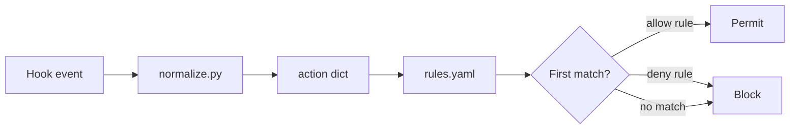
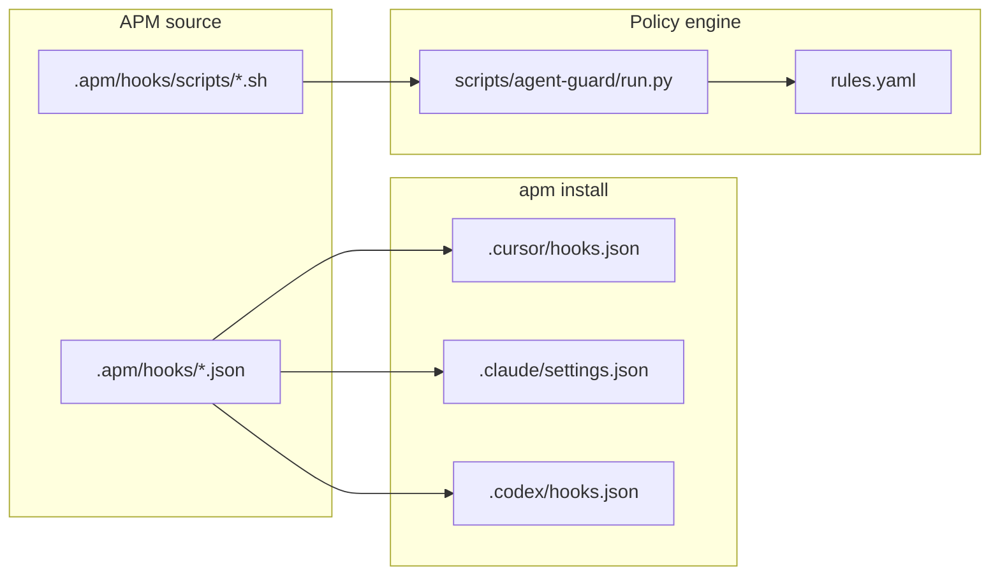

# Agent Guard — mutating-operation guardrails

Shared policy engine and APM-deployed hooks for Cursor, Claude Code, and Codex.

## Overview

| Component | Path | Role |
|---|---|---|
| APM hook sources | `.apm/hooks/agent-guard-*-hooks.json` | Merged into each harness on install |
| Hook scripts | `.apm/hooks/scripts/*.sh` | Thin adapters (resolve engine path) |
| Policy engine | `scripts/agent-guard/` | Shared rule evaluation |
| Rule definitions | `scripts/agent-guard/rules.yaml` | deny / allow policy |

**Deploy artifacts** (`.cursor/hooks.json`, `.claude/settings.json`, `.codex/hooks.json`, etc.) are generated by `apm install`. Do not commit them; they are listed in `.gitignore`.

## Policy model

Agent Guard is **fail-closed (deny by default)**. It does **not** allow “anything that looks read-only”; only actions that match an explicit **allow** rule in `rules.yaml` are permitted.

1. A hook event is normalized into an **action** (`kind`, plus fields such as `command`, `operation`, `method`, `read_only`).
2. Rules are evaluated **top to bottom**; the **first matching rule** wins.
3. If nothing matches, `default: deny` applies.

Deny rules are listed before allow rules in `rules.yaml` so dangerous operations are blocked even when a later allow rule might also match. When customizing rules, keep that ordering in mind.



Secret scanning is handled separately (pre-commit), not by these hooks.

## What is blocked

Explicit **deny** rules (non-exhaustive; see `rules.yaml`):

| Category | Examples |
|---|---|
| Privilege escalation | `sudo`, `doas`, `pkexec` |
| Destructive git | `git push --force`, `git reset --hard`, `git push +ref`, … |
| Git hook bypass | `git commit --no-verify`, `git commit --no-gpg-sign` |
| Mutating / DDL SQL | `INSERT`, `UPDATE`, `DELETE`, `DROP`, … (via `kind: sql` or shell patterns) |
| Mutating kubectl | `apply`, `delete`, `exec`, `patch`, … (token-based detection on shell commands) |
| Mutating HTTP | `POST` / `PUT` / `PATCH` / `DELETE`; body/upload flags (`-d`, `--data-*`, `--post-file`, `-F`, …) even when `-X GET` is set |
| Mutating `gh` | Write subcommands (`gh pr create`, …); `gh api` without explicit `-X GET`; `gh api -X POST` (etc.) |

Everything else that does not hit an allow rule is **denied** by default.

## What is allowed

Only actions that match an **allow** rule:

| Rule id | Applies to |
|---|---|
| `allow-file` | File tool create / edit / delete (`kind: file`) |
| `allow-mcp` | MCP tool calls (`kind: mcp`) |
| `allow-git-commit-push` | `git commit`, `git push` (except hook-bypass flags, which are denied earlier) |
| `allow-sql-read` | `kind: sql` with a read operation (`select`, `show`, … per `vocab.sql_read`) |
| `allow-http-read` | `kind: http` with a read method (`GET`, `HEAD`, `OPTIONS` per `vocab.http_read`) |
| `allow-read-only-shell` | `kind: shell` where normalization sets `read_only: true` (e.g. `git status`, `kubectl get`, `curl` without mutating flags, read-only `gh` subcommands, `gh api -X GET …`) |

Shell commands that normalization cannot classify as read-only (unknown programs, redirects, substitutions, interactive SQL clients without an inline statement, etc.) **do not** match `allow-read-only-shell` and are denied.

## Prerequisites

- `python3` (3.10+)
- PyYAML (`python3 -m pip install pyyaml`) — loads `rules.yaml`
- [APM CLI](https://microsoft.github.io/apm/)

## Install (APM)

### Consumer repository

Add the root package to `apm.yml`:

```yaml
dependencies:
  apm:
    - takak2166/agent
```

Create harness directories, then install:

```bash
mkdir -p .cursor .claude .codex
apm install --target cursor,claude,codex
```

Instructions (rules) and hooks (agent-guard) deploy together.

### This repository (dev / dogfooding)

```bash
apm install --target cursor,claude,codex
```

### User-wide (`-g`)

```bash
apm install -g takak2166/agent --target cursor,claude,codex
```

With `-g`, `${PLUGIN_ROOT}` is rewritten to absolute paths ([APM hooks docs](https://microsoft.github.io/apm/producer/author-primitives/hooks-and-commands/)).

### Hook script paths

- Claude and Codex hook JSON use `${PLUGIN_ROOT}/.apm/hooks/scripts/…`.
- Cursor hook JSON uses a repo-relative path (`./.apm/hooks/scripts/…`).
- All wrapper scripts resolve the engine in this order: `AGENT_GUARD_ROOT` → `PLUGIN_ROOT` (or Cursor/Claude plugin env vars) → path relative to the repo root.

## Manual testing

```bash
# allow (permission: allow in JSON; exit code 0)
echo '{"command":"git status"}' | python3 scripts/agent-guard/run.py --target cursor

# deny (permission: deny in JSON; exit code 0)
echo '{"command":"sudo apt update"}' | python3 scripts/agent-guard/run.py --target cursor

# gh api requires explicit -X GET
echo '{"command":"gh api -X GET repos/o/r"}' | python3 scripts/agent-guard/run.py --target cursor

# Claude-shaped payload
echo '{"tool_name":"Bash","tool_input":{"command":"kubectl apply -f x.yaml"}}' \
  | python3 scripts/agent-guard/run.py --target claude --source claude | jq .

# unit tests
cd scripts/agent-guard
python3 -m pip install -r requirements-dev.txt
python3 -m pytest tests/ -q
```

## Mutation testing

Mutation tests use [mutmut](https://mutmut.readthedocs.io/) on the core policy modules (`engine.py`, `normalize.py`, `policy_loader.py`). CI runs them in a separate workflow job and fails if the score drops below `scripts/agent-guard/mutmut-baseline.json`.

```bash
cd scripts/agent-guard
python3 -m pip install -r requirements-dev.txt
mutmut run
mutmut export-cicd-stats
python3 check_mutmut_score.py
```

Subprocess integration tests (`RunPyTests`, `WrapperFallbackTests`) are excluded from the mutmut pytest selection because they depend on hook scripts outside the mutant sandbox.

## Customizing rules

Edit `scripts/agent-guard/rules.yaml`. Evaluation is **first match wins**; keep deny rules above allow rules.

Shared word lists (SQL verbs, HTTP methods, kubectl verbs, `gh` subcommands, etc.) live in the top-level `vocab:` section. Rules reference them with `$vocab.<key>`; shell regex patterns are generated from vocab via `$pattern.<key>` (see `policy_loader.py`). Normalization and the policy engine both read these lists; some shell classification heuristics (git subcommands, read-only prefixes, redirect detection) remain in `normalize.py`.

Override the engine location with `AGENT_GUARD_ROOT` if needed. The `--rules` flag selects which `rules.yaml` the engine loads; normalization currently always uses the default vocab beside `run.py` (custom `--rules` paths are intended for engine rules only until a follow-up unifies both paths).

## Audit log

When `--audit-log PATH` or `AGENT_GUARD_AUDIT_LOG` is set, decisions are appended as JSON Lines to that file (for example `.agent-guard/audit.log`). Audit logging is opt-in; it is disabled by default.

## Architecture



## Troubleshooting

| Symptom | What to try |
|---|---|
| Hooks do not run | Re-run `apm install`; reload / restart Cursor |
| Everything is denied | Ensure PyYAML is installed and `python3` is on `PATH`; check whether the command matches an allow rule (deny-default) |
| Engine path errors | Set `AGENT_GUARD_ROOT` or confirm `PLUGIN_ROOT` / repo-relative fallback in hook scripts |

## Related

- [APM Hooks and commands](https://microsoft.github.io/apm/producer/author-primitives/hooks-and-commands/)
- [Cursor Hooks](https://cursor.com/docs/agent/hooks)
