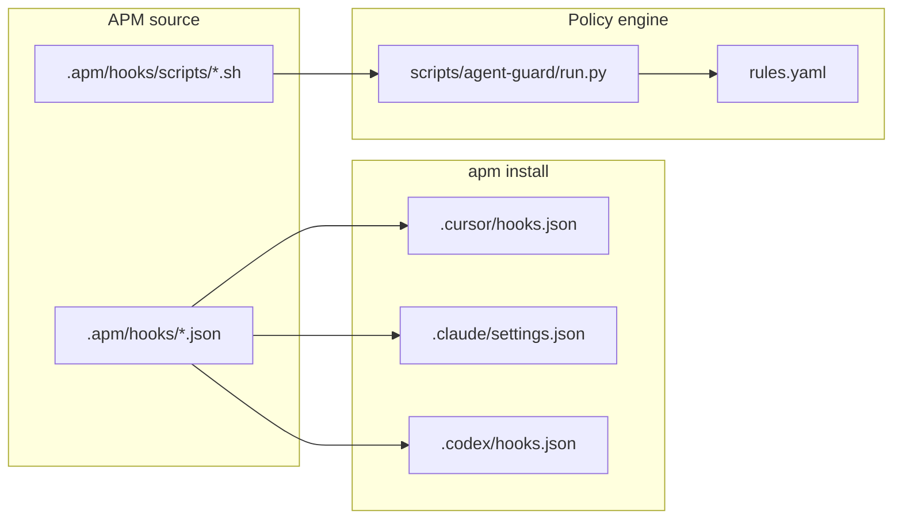

# Agent Guard — mutating-operation guardrails (TAK-99)

Shared policy engine and APM-deployed hooks for Cursor, Claude Code, and Codex.

## Overview

| Component | Path | Role |
|---|---|---|
| APM hook sources | `.apm/hooks/agent-guard-*-hooks.json` | Merged into each harness on install |
| Hook scripts | `.apm/hooks/scripts/*.sh` | Thin adapters (use `${PLUGIN_ROOT}`) |
| Policy engine | `scripts/agent-guard/` | Shared rule evaluation |
| Rule definitions | `scripts/agent-guard/rules.yaml` | deny / allow policy |

**Deploy artifacts** (`.cursor/hooks.json`, `.claude/settings.json`, `.codex/hooks.json`, etc.) are generated by `apm install`. Do not commit them; they are listed in `.gitignore`.

## Blocked / allowed

### Blocked

- Commands that include `sudo`
- Mutating / DDL SQL
- Mutating kubectl verbs (`apply`, `delete`, `exec`, etc.)
- Mutating HTTP (`curl -X POST|PUT|PATCH|DELETE`)
- `git commit --no-verify` / `--no-gpg-sign`
- Destructive git (`push --force`, `reset --hard`, etc.)

### Allowed

- File create / edit / delete (tracked and untracked)
- `git commit` / `git push` (except hook-bypass flags)
- MCP writes
- Read-only operations

Secret scanning is handled separately (pre-commit), not by these hooks.

## Prerequisites

- `python3` (3.10+)
- `yq` (loads rules YAML)
- [APM CLI](https://microsoft.github.io/apm/)

## Install (APM)

### Consumer repository

Add the root package to `apm.yml`:

```yaml
dependencies:
  apm:
    - takak2166/agent
```

Create harness directories, then install:

```bash
mkdir -p .cursor .claude .codex
apm install --target cursor,claude,codex
```

Instructions (rules) and hooks (agent-guard) deploy together.

### This repository (dev / dogfooding)

```bash
apm install --target cursor,claude,codex
```

### User-wide (`-g`)

```bash
apm install -g takak2166/agent --target cursor,claude,codex
```

With `-g`, `${PLUGIN_ROOT}` is rewritten to absolute paths ([APM hooks docs](https://microsoft.github.io/apm/producer/author-primitives/hooks-and-commands/)).

## Manual testing

```bash
# allow
echo '{"command":"git status"}' | python3 scripts/agent-guard/run.py --adapter cursor-shell

# deny (exit 2)
echo '{"command":"sudo apt update"}' | python3 scripts/agent-guard/run.py --adapter cursor-shell

# Claude-shaped payload
echo '{"tool_name":"Bash","tool_input":{"command":"kubectl apply -f x.yaml"}}' \
  | python3 scripts/agent-guard/run.py --adapter claude | jq .

# unit tests
python3 -m unittest discover -s scripts/agent-guard/tests -v
```

## Customizing rules

Edit `scripts/agent-guard/rules.yaml`. **Deny rules take precedence over allow rules.**

Override the engine location with `AGENT_GUARD_ROOT` if needed.

## Audit log

Decisions are appended to `.agent-guard/audit.log` (JSON Lines).

## Architecture



## Troubleshooting

| Symptom | What to try |
|---|---|
| Hooks do not run | Re-run `apm install`; reload / restart Cursor |
| Everything is denied | Ensure `yq` and `python3` are on `PATH` |
| Engine path errors | Confirm `PLUGIN_ROOT` or fall back to `$ROOT/scripts/agent-guard` |

## Related

- Linear: [TAK-99](https://linear.app/me-time/issue/TAK-99)
- [APM Hooks and commands](https://microsoft.github.io/apm/producer/author-primitives/hooks-and-commands/)
- [Cursor Hooks](https://cursor.com/docs/agent/hooks)
